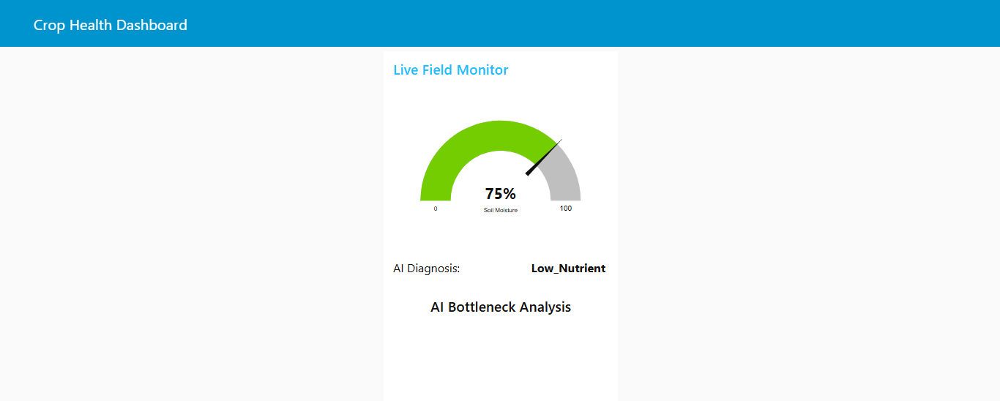
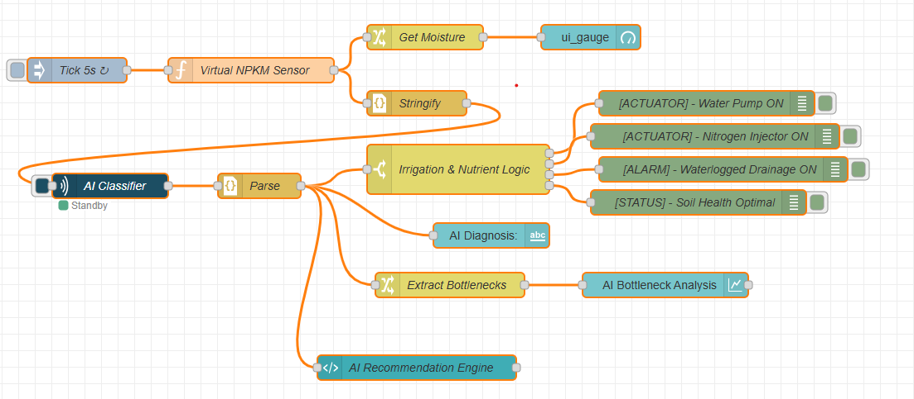

# Intelligent Crop Health Classifier 🌿🤖

An autonomous system that classifies field "Health Zones" using soil NPK and moisture levels via a Random Forest model.

## 🚀 The Vision
This project moves beyond simple "dry/wet" irrigation. It uses Machine Learning to understand nutrient balance and provide specific recommendations for crop growth stages.

## 📸 Results
### System Dashboard

### Logic Flow (Node-RED)

## 🛠️ Tech Stack
- **Logic**: Node-RED
- **AI/ML**: Python (Scikit-Learn, Random Forest)
- **Communication**: Stdin/Stdout via `node-red-contrib-pythonshell`
- **Dashboard**: `node-red-dashboard`

## 🏃 How to Run
1. Install dependencies: `pip install -r requirements.txt`
2. Import `flow.json` into your Node-RED instance.
3. Update the Python file path in the `pythonshell` node.
4. Open the dashboard at `http://localhost:1880/ui`.
